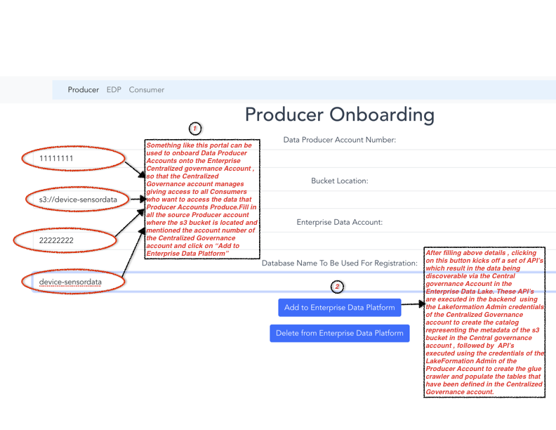
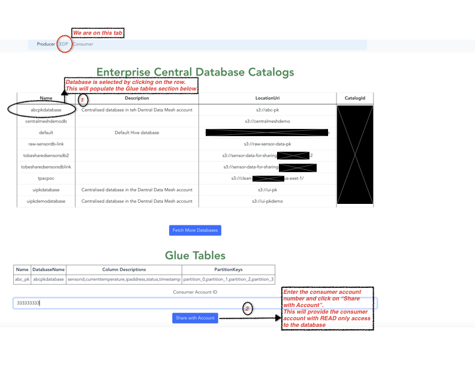
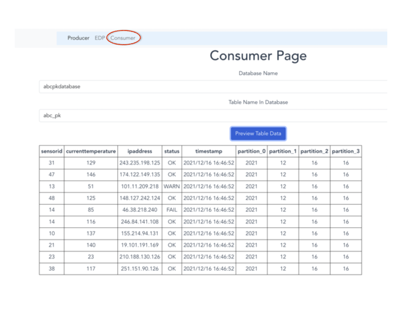

1. This project is a very simple representation to show one of the ways to create a centralized data mesh for a data lake. This UI can be used to create a mental model of the sequence of steps that could be performed for onboarding any Producer Account which has data that need to be discoverable in an Enterprise Data Lake using the Centralised Data Mesh Pattern. 
2. A Central Data Mesh Pattern has  data published to the Central Governance Account by Prodducer Account so that it is discoverable.
3. Sharing of permissions is managed through teh Central Governance Account
4. As a first step, click on the Producer Tab and enter the details of the Producer Account and the bucket to share .
5. The diagram below shows sample details of the UI. 
 
For the above diagram , when you click on "Add to enterprise Data Platform" a sequence of API's are invoked from datamesh-centralized-api/server.js .
A gist of the API's is as follows.  
    + Producer shares the bucket with the governance account. 
    + The Lakeformation Admin of the Governance Account will create the catalog and share it back with the Producer Account. 
    + The Lakeformation Admin in teh Producer account provides permissions to the Glue Crawler's IAM role to write into teh shared catalog from the governance account.
    + The crawler runs. You can return back to the Governance Account(EDP) tab and see the contents of all catalogs and tables.
6. As a second step, click on the Central Governance (EDP) tab and you can see all the databases that are discoverable , select the database and you can see the tables and then enter a consumer account number to give READ only access , so that the consumer can query through Athena in its account. Once you click on ....  a sequence of API's are invoked from datamesh-centralized-api/server.js. A gist of the API's are as follows  
    + Central Governance Account shares with Consumer account.
    + On the Consumer Account tab, as the Lakeformation Admin , you can query the data through Athena. 
    + Consumer Account Lake formation Admin can provide grantable access to other users in the consumer account. 

7. As a third step, enter relevant database and table in Consumer tab to preview teh contents of the table. 
    + 

Instruction to run the backend API's and the UI
 + Replace ACCESS_ID_PRODUCER_ACCOUNT_IAM_ADMIN_WHO_RUNS_THIS_TOOL, ACCESS_KEY_CENTRAL_ACCOUNT_IAM_ADMIN_WHO_RUNS_THIS_TOOL , ACCESS_KEY_CONSUMER_ACCOUNT_IAM_ADMIN_WHO_RUNS_THIS_TOOL,SECRET_ACCESS_KEY_CENTRAL_ACCOUNT_IAM_ADMIN_WHO_RUNS_THIS_TOOL,SECRET_KEY_PRODUCER_ACCOUNT_IAM_ADMIN_WHO_RUNS_THIS_TOOL and SECRET_KEY_CONSUMER_ACCOUNT_IAM_ADMIN_WHO_RUNS_THIS_TOOL with appropriate credentials. This tool is just to understand the sequence of API's. For ease, the admin of each of teh accounts can be added as Lakeformation Admin in the respective accounts.
 + execute `npm install` in datamesh-frontend folder 
 + execute `npm run build` in datamesh-frontend folder. this will create teh ui distributable in datamesh-frontend/dist folder
 + execute `npm install' in datamesh-centralized-api folder
 + execute `node server.js` in datamesh-centralized-api folder. this will bring up the ui in localhost:3080 
 + the api's are in datamesh-centralized-api folder.
 + to understand the sequence of api's called when you onboard a producer bucket, follow the sequence of calls in addtoEDP() method in the Producer.vue file in the datamesh-frontend project
 + to understand the sequence of api's called on the Central Governance EDP Page and for sharing access to Cosnumer account follow the sequence of calls in the EDP.vue file  in the datamesh-frontend project.
 + to follow sequence of api's called for Consumer page follow teh sequence of calls in Consumer.vue file.